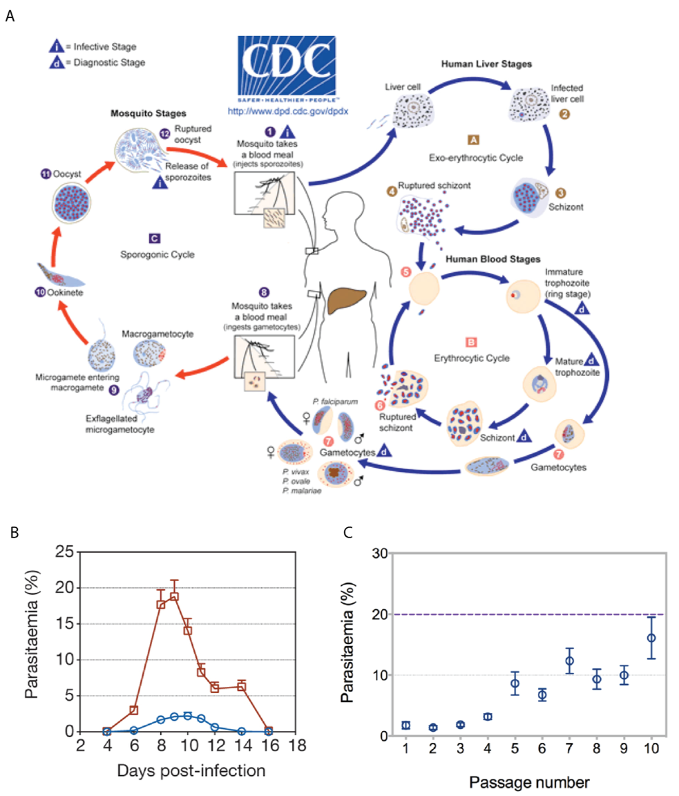
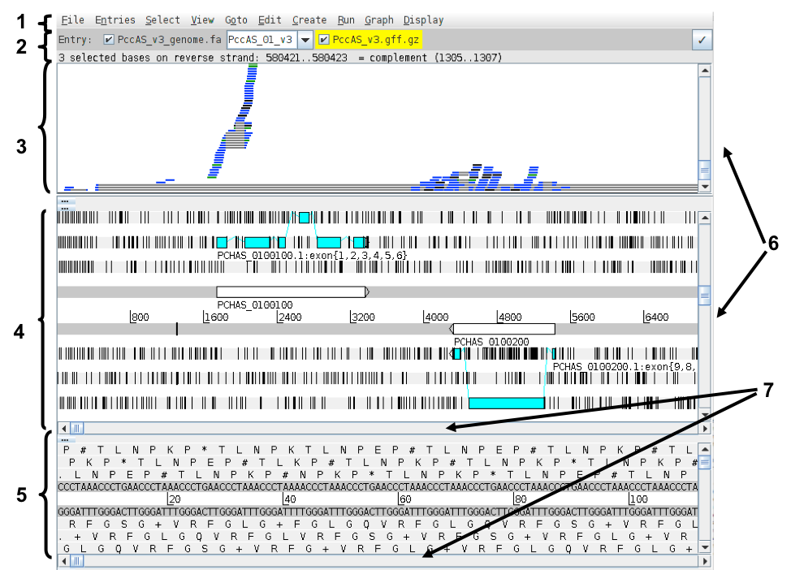
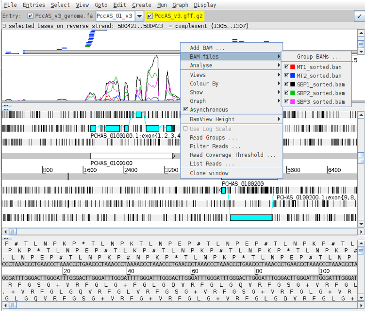

# Module 5 - RNA-seq 1


## Table of contents
1. [Introduction & Aims](#introduction)
2. [RNAseq1 Exercise 1 - Mapping RNA-seq reads to the genome using HISAT2](#exercise1)
3. [RNAseq1 Exercise 2 - Using Artemis to visualise transcription](#exercise2)
4. [RNAseq1 Exercise 3 - Using Kallisto and Sleuth to identify differentially expressed genes](#exercise3)
5. [RNAseq1 Exercise 4 - Using Sleuth to check the quality of the data](#exercise4)
6. [RNAseq1 Exercise 5 - Interpreting the results](#exercise5)
7. [RNAseq1 Extended reading](#reading)


**Instructors**: [Adam Reid](mailto:ar11@sanger.ac.uk) & [Stephen Doyle](mailto:sd21@sanger.ac.uk), Wellcome Sanger Institute


## 1. Introduction <a name="introduction"></a>

Understanding the genome is not simply about understanding which genes are there. Understanding when each gene is used helps us to find out how organisms develop and which genes are used in response to particular external stimuli. The first layer in understanding how the genome is used is the transcriptome. This is also the most accessible because like the genome the transcriptome is made of nucleic acids and can (directly or indirectly) be sequenced using the same technology. Arguably the proteome is of greater relevance to understanding cellular biology however it is chemically heterogeneous making it much more difficult to assay. 

Over the past decade or two microarray technology has been extensively applied to addressing the question of which genes are expressed when. Despite its success this technology is limited in that it requires prior knowledge of the gene sequences for an organism and has a limited dynamic range in detecting the level of expression. RNA sequencing technology, using for instance Illumina TruSeq library preparation and HiSeq sequencing machines, can sequence essentially all the genes which are transcribed and the results have a more linear relationship to the real number of transcripts generated in the cell.

The aim of differential expression analysis is to determine which genes are more or less expressed in different situations. We could ask, for instance, whether a bacterium uses its genome differently when exposed to stress, such as excessive heat or a drug. Alternatively we could ask which genes make human livers different from human kidneys. 

In this module we will address the effect of vector transmission on gene expression of the malaria parasite. Figure 1A shows the malaria life cycle, the red part highlighting the mosquito stage. Figure 1B shows the difference in virulence, measured by blood parasitemia, between mosquito-transmitted and serially blood passaged parasites. Is the transcriptome of a mosquito-transmitted parasite different from one which has not passed through a mosquito? The key reason for asking this question is that parasites which are transmitted by mosquito are less virulent in mice than those which are serially blood passaged in the laboratory. While mosquito transmitted and serially blood passaged parasites have exactly the same set of genes, perhaps they are using those genes differently. The data in this exercise, as well as figures 1B and 1C are taken from [Spence et al. (2013).](https://www.ncbi.nlm.nih.gov/pubmed/23719378)



**Figure 1. Serial blood passage increases virulence of malaria parasites.** (A) The lifecycle of plasmodium parasites involves mammalian and mosquito stages. Experiments in the lab often exclude the mosquito stage (red) and instead remove parasites from the blood of a mouse to infect another mouse (serial blood passage). (B) Serially blood passaged parasites (red) are more virulent than mosquito-transmitted parasites (blue) as shown by their higher parasitemia over the course of infection. (C) As mosquito transmitted parasites are serially blood passaged an increasing number of times, they return to a higher level of parasitemia.

Figure 1C shows that increasing numbers of blood passages after mosquito transmission result in increasing virulence, back to around 20% parasitemia. Subsequent mosquito transmission of high virulence parasites renders them low virulence again. We hypothesise that parasites which have been through the mosquito are somehow better able to control the mosquito immune system than those which have not. This control of the immune system would result in lower parasitemia because this is advantageous for the parasite. Too high a parasitemia is bad for the mouse and therefore bad for the parasite. Are there any differences between the transcriptomes of serially blood passaged parasites and mosquito-transmitted parasites which might explain how they are able to do this? 

 [↥ **Back to top**](#top)

 ******
## RNA-seq 1 Exercise 1 - Mapping RNA-seq reads to the genome using HISAT2 <a name="exercise1"></a>

We have two conditions: serially blood-passaged parasites (SBP) and mosquito transmitted parasites (MT). One with three biological replicates (SBP), one with two (MT). Therefore we have five RNA samples, each which has been sequenced on an Illumina HiSeq sequencing machine. For this exercise we have reduced the number of reads in each sample to around 2.5m to reduce the mapping time. However this will be sufficient to detect most differentially expressed genes.

Firstly, make a HISAT2 index for the P. chabaudi genome reference sequence.

```shell
# type the following into the terminal

hisat2-build PccAS_v3_genome.fa PccAS_v3_hisat2idx
```

Map the reads for the MT1 sample using HISAT2. Each of the following steps will take a couple of minutes. 

```shell
# type the following into the terminal
hisat2 --max-intronlen 10000 -x PccAS_v3_hisat2idx -1 MT1_1.fastq.gz -2 MT1_2.fastq.gz -S MT1.sam
```

Convert the SAM file to a BAM.

```shell
# type the following into the terminal
samtools view -b -o MT1.bam MT1.sam
```

Sort the BAM file (otherwise the indexing won’t work)

```shell
# type the following into the terminal
samtools sort -o MT1_sorted.bam MT1.bam
```

Index the BAM file so that it can be read efficiently by Artemis

```shell
# type the following into the terminal
samtools index MT1_sorted.bam
```

Now map, convert SAM to BAM, sort and index with the reads from the MT2 sample.

Note the BAM files and .bai index files provided for the SBP samples:

```shell
# type the following into the terminal
ls *bam*
```

 [↥ **Back to top**](#top)

 ******
## RNA-seq 1 Exercise 2 - Using Artemis to visualise transcription <a name="exercise2"></a>

Index the fasta file so Artemis can view each chromosome separately

```shell
# type the following into the terminal
samtools faidx PccAS_v3_genome.fa
```

Load chromosome 14 into Artemis from the command line, displaying the mapped reads from each sample:

```shell
# type the following into the terminal
art -Dbam="MT1_sorted.bam,MT2_sorted.bam,SBP1_sorted.bam,SBP2_sorted.bam,SBP3_sorted.bam" PccAS_v3_genome.fa +PccAS_v3.gff.gz &
```

Select ”Use index” so Artemis will show individual chromosomes.



The Artemis and BAM view windows:

1.	Drop-down menus
2. Entry (top line): shows which entries are currently loaded with the default entry highlighted in yellow You can select different chromosomes to view here.
3.	BAM view: Displays reads mapped to the genome sequence. Each little horizontal line represents a sequencing read. Some reads are blue indicating that they are unique reads. Green reads represent multiple reads mapped to exactly the same position on the reference sequence. Grey lines in the middle of reads mean that the read has been split and this usually means it maps over an intron. If you click a read its mate pair will also be selected. If you want to know more about a read right-click and select ‘Show details of: READ NAME’.
4. Sequence view panel. The central two grey lines represent the forward (top) and reverse (bottom) DNA strands. Above and below these are the three forward and three reverse reading frames (theoretical translations of the genome). Stop codons are marked as black vertical bars. Genes and other annotated features are displayed as coloured boxes. We often refer to predicted genes as coding sequences or CDSs.
5. This panel has a similar layout to the main panel but is zoomed in to show nucleotides and amino acids. 
6.	Sliders for zooming view panels.
7.	Sliders for scrolling along the DNA.

Right click on the BAM view, select *Graph, then *Coverage.

Right click on the BAM window showing the reads and hover over BAM files. This will show you which colours in the coverage plot relate to which samples. Scroll through the chromosome and see if you can identify genes which might be differentially expressed between SBP and MT parasites. Is looking at the coverage plots alone a reliable way to assess differential expression? Hint: what is the difference between read count and RPKM? Are the libraries all the same size?



Select chromosome PccAS_14_v3 from the drop down box on the Entry line.

Press Ctrl-g and use “Goto Feature With Gene Name” to navigate to the gene PCHAS_1402500. 


******
## License
<a rel="license" href="http://creativecommons.org/licenses/by/4.0/"></a><br />This work is licensed under a <a rel="license" href="http://creativecommons.org/licenses/by/4.0/">Creative Commons Attribution 4.0 International License</a>.

